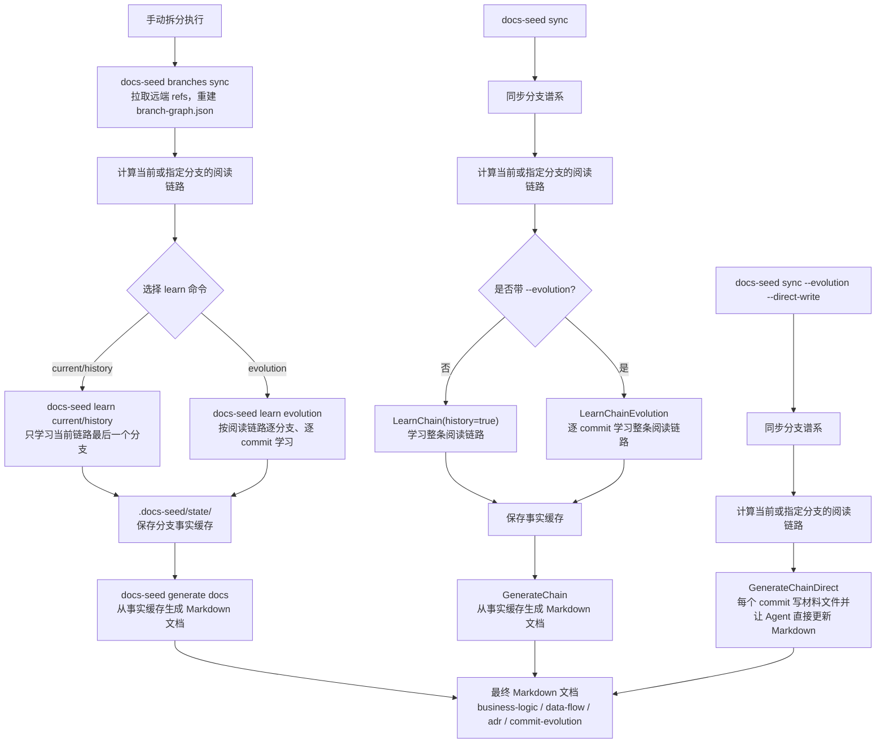

# Docs Seed

Docs Seed 从现有代码、Git 历史和主分支派生关系生成面向人类的项目文档。它借鉴
[Skills Seed](https://github.com/silaswei-io/skills-seed) 的增量学习与本地产物模式，
但输出目标不是 Agent Skills，而是业务逻辑和数据流转文档。

## 文档边界

Docs Seed 只回答：

- 系统实现了哪些业务规则、状态变化和业务编排。
- 数据从哪里进入，经过哪些处理，写入哪里，并如何流向外部系统。
- 异常、失败和补偿路径在业务上有什么影响。
- 源码结构、配置边界、数据所有权和流程编排已经体现了哪些架构决策。

Docs Seed 不生成函数签名、API 调用示例、CLI 命令、参数说明、安装步骤或具体代码
调用方式。ADR 结果文档只记录已有源码证据支持的决策、取舍和后果，不替团队编造未来
决策。实现细节仍以源码和 Git 历史为准。

## 分支增量模型

项目在根目录的 `.docs-seed.yml` 中配置主分支匹配规则：

```yaml
branches:
  remote: origin
  main_patterns:
    - main
    - master
    - llm/**
  parent_overrides: {}
```

`docs-seed branches sync` 先执行 `git fetch --all --prune`，然后从本地和所选远端的
refs 建立主分支谱系。谱系只依赖 Git 提交图；非主分支可以位于两个主分支之间，工具
会沿提交祖先继续回溯，直到找到匹配的父主分支。

例如主分支关系为 `A → B → C`：

- A 保存代码在 A tip 上体现的全量业务和数据流。
- B 只保存 B 相对 A fork point 的增量。
- C 只保存 C 相对 B fork point 的增量。

当 Git 证据无法唯一确定父主分支时，在 `parent_overrides` 中显式配置。工具不会让
LLM 猜测分支关系。计算结果保存在 `.docs-seed/branch-graph.json`。

## 安装

远程安装需要指定 CLI 所在的子包路径：

```bash
go install github.com/Makia9879/docs-seed/cmd/docs-seed@latest
```

安装指定版本时同样要带 `/cmd/docs-seed`：

```bash
go install github.com/Makia9879/docs-seed/cmd/docs-seed@0.1.0
```

不要安装模块根路径：

```bash
go install github.com/Makia9879/docs-seed@0.1.0
```

模块根目录不包含 `main` package，所以会报 `does not contain package github.com/Makia9879/docs-seed`。
本项目 `go.mod` 要求 Go 1.25.6 或更高版本；较低版本的 Go 可能会自动切换工具链。

本地源码安装：

```bash
git clone https://github.com/Makia9879/docs-seed.git
cd docs-seed
go install ./cmd/docs-seed
```

## 快速开始

在要分析的 Git 仓库根目录执行：

```bash
docs-seed init
```

按项目实际情况修改 `.docs-seed.yml`。最常见需要调整的是主分支匹配、父分支关系、
Agent 和文档输出目录：

```yaml
branches:
  main_patterns:
    - develop_V*
  parent_overrides:
    develop_V1.0.0: __root__
    develop_V2.0.0: develop_V1.0.0
    develop_V2.1.0: develop_V2.0.0
agent:
  engine: claude
  commands:
    claude: claude
    codex: codex
  timeout_seconds: 1800
evolution:
  batch_size: 8
  diff_max_bytes: 120000
  max_batch_bytes: 240000
  direct_keep_recent: 500
docs:
  output: ../docs-seed-docs/ca_admin
```

同步分支谱系并生成当前分支文档：

```bash
docs-seed branches sync
docs-seed sync --evolution
```

指定目标主分支：

```bash
docs-seed sync --evolution --branch develop_V2.1.0
```

如果 Claude/Codex 的 JSON 输出不稳定，使用 direct-write，让 Agent 直接更新 Markdown：

```bash
docs-seed sync --evolution --direct-write --branch develop_V2.1.0
```

调试时先处理 1 个新提交：

```bash
docs-seed sync --evolution --direct-write --branch develop_V2.1.0 --limit-commits 1
```

常用查看命令：

```bash
docs-seed preview branches
docs-seed preview files
```

生成结果默认位于：

```text
.docs-seed/docs/
├── README.md
└── branches/
    ├── main/
    │   ├── README.md
    │   ├── business-logic.md
    │   ├── adr.md
    │   ├── commit-evolution.md
    │   └── data-flow.md
    └── llm__order-v2/
        ├── README.md
        ├── business-logic.md
        ├── adr.md
        ├── commit-evolution.md
        └── data-flow.md
```

分支名中的 `/` 在目录名中写为 `__`，文档正文仍保留原始分支名。

## 命令

### 命令关系

`sync` 是面向日常使用的编排命令：它会先同步分支谱系，再执行对应的学习流程，最后
把已学习事实落成 Markdown 文档。需要拆开调试时，可以分别运行 `branches sync`、
`learn ...` 和 `generate docs`。



| 命令 | 作用 |
|---|---|
| `docs-seed init` | 创建 `.docs-seed.yml` 和状态目录 |
| `docs-seed init --workspace` | 初始化多 Git 子项目 workspace |
| `docs-seed branches sync` | 拉取远端 refs 并重建分支谱系 |
| `docs-seed learn current` | 学习当前匹配主分支的代码事实 |
| `docs-seed learn history` | 结合提交历史学习当前分支 |
| `docs-seed learn evolution` | 从根主分支第一个提交开始，按提交顺序分批学习当前链路的业务演进 |
| `docs-seed generate docs` | 从已学习事实生成当前分支链文档 |
| `docs-seed sync` | 同步谱系、学习当前链路并生成文档 |
| `docs-seed sync --evolution` | 同步谱系、批量读取提交并学习业务演进，最后生成文档 |
| `docs-seed sync --evolution --direct-write` | 让 Agent 直接写 Markdown 文档，主进程只负责 Git 范围和进度 |
| `docs-seed sync --branch <name>` | 为指定匹配主分支生成完整阅读链 |
| `docs-seed workspace add` | 扫描并初始化第一层独立 Git 子项目 |
| `docs-seed preview branches` | 只读预览计算得到的分支谱系 |
| `docs-seed preview files` | 预览当前链路的 fork point 和 tip |

`sync` 和学习命令只分析已提交代码。工作树有未提交修改时会给出警告，不会把这些
修改混入文档，也不会切换用户当前分支。非当前分支通过 `git archive` 创建临时只读
快照供 Agent 分析。

## Workspace

```bash
docs-seed init --workspace
docs-seed workspace add
docs-seed sync
```

workspace 根目录只保存子项目索引。每个独立 Git 子项目拥有自己的 `.docs-seed.yml`、
分支谱系、学习状态和文档，避免不同仓库的主分支关系相互污染。

## 本地状态

```text
.docs-seed/
├── branch-graph.json       # 可版本化的分支谱系
├── docs/                   # 可版本化的人类阅读文档
├── state/                  # 本地学习事实，默认忽略
└── memory/                 # Agent 运行信息，默认忽略
```

生成文档末尾保留文件级证据和 commit 范围，用于人工核验；不会写代码调用步骤。每个
分支目录包含业务逻辑、数据流转和 ADR 三类结果文档。使用 `--evolution` 时还会生成
`commit-evolution.md`，按 Git 提交顺序列出每次提交提取出的业务演进事实，供人工或
后续 LLM 复核最终汇总如何形成。

## 提交演进模式

`docs-seed sync --evolution --branch <target>` 会先计算目标主分支的阅读链，例如
`A → B → C`，再按链路依次学习：

- 对根主分支 A，从 Git 可达历史的第一个提交开始，按 `git log --reverse` 顺序读取
  每个 commit 的 message、变更文件和 diff。
- 对增量主分支 B/C，只读取其相对父主分支 fork point 之后的 commit。
- Docs Seed 会按 `evolution.batch_size` / `--batch-size` 把有效 commit 切成批次；
  每次 Agent session 只接收当前批次的材料，不会把从第一个 commit 到当前 commit 的所有
  历史都累积进同一个上下文。每个 commit 仍会单独保存缓存事实，落在
  `.docs-seed/state/commits/<branch>/`。
- 分支级 `business-logic.md`、`data-flow.md`、`adr.md` 由这些 commit 事实去重汇总。
- `commit-evolution.md` 保留逐 commit 演进链，便于其他 LLM 继续审查、补充或重写总结。

默认批次大小为 8，可在配置里长期调整，也可单次运行覆盖：

```bash
docs-seed sync --evolution --branch <target> --batch-size 12
docs-seed learn evolution --batch-size 12
```

如果 Claude/Codex 报 context 超限，优先调低 `evolution.max_batch_bytes` 或
`diff_max_bytes`。`diff_max_bytes` 是单个 commit diff 的截断上限，`max_batch_bytes`
是单次 Agent 调用的总体材料上限；超过阈值时会继续把当前批次拆小。若单个 commit
仍然过大，需要降低 diff 截断或让提示词引导 Agent 按文件分块阅读材料。

如果本地 CLI Agent 的 JSON 输出不稳定，可以使用：

```bash
docs-seed sync --evolution --direct-write --branch <target>
```

direct-write 模式下，Docs Seed 不再解析 Agent 返回的 JSON。它把分支链路、commit
message、变更文件和 diff 写入 `.docs-seed/tmp/direct-write/` 的单提交材料文件，
再指挥 Claude/Codex 读取该材料文件并直接写
`business-logic.md`、`data-flow.md`、`adr.md` 和 `commit-evolution.md`。主进程只
负责 Git 范围、进度回显、结果校验和根索引生成。每个有效提交处理后，
上述结果文档中至少要有一个文件包含该 commit 的完整 hash 或短 hash；否则本次同步会失败，
避免 Agent 没有真正更新最终文档却继续向后处理。direct-write prompt 会要求 Agent 在写完后
调用 `docs-seed direct-record --output <branch-doc-dir> --source agent-direct-write <commit-hash...>`，幂等地补写
`commit-evolution.md` 记录，避免批处理中遗漏某个 commit hash。

direct-write 的恢复存档保存在最终文档根目录：

```text
<docs.output>/docs-seed-checkpoint.json
```

为避免长时间运行后单个结果文件过大，direct-write 会按 `evolution.direct_keep_recent`
保留最近提交的活跃记录，默认 500 条。更早的 `commit-evolution.md` 小节会移动到：

```text
<docs.output>/branches/<branch>/archive/commit-evolution.md
```

`docs-seed-checkpoint.json` 中较早的 `processed_commits` 明细会移动到：

```text
<docs.output>/archive/docs-seed-checkpoint/<branch>.jsonl
```

归档文件仍参与续跑查重：Docs Seed 读取存档点时会加载 JSONL 归档索引，校验结果文档时也会查询
`archive/commit-evolution.md`，因此截断不会丢失历史记录，也不会让已处理 commit 被重复投递给 Agent。

每次运行都会重新计算当前阅读链路和各分支段的提交集合，并优先按存档点判断是否跳过。
只要 `docs-seed-checkpoint.json` 或归档 JSONL 已记录该 commit，Docs Seed 就会跳过该提交，
不再用最终 Markdown 文档反向否定存档点。如果结果文档已有记录但存档点缺失，Docs Seed 会补写存档点。

调试 Agent 写入行为时可以限制处理数量：

```bash
docs-seed sync --evolution --direct-write --branch <target> --limit-commits 1
```

## 开发验证

```bash
docker run --rm \
  -v "$PWD":/workspace \
  -w /workspace \
  golang:1.25.6-bookworm \
  sh -c '/usr/local/go/bin/gofmt -w . &&
    /usr/local/go/bin/go mod tidy &&
    /usr/local/go/bin/go vet ./... &&
    /usr/local/go/bin/go test ./... &&
    /usr/local/go/bin/go build -o dist/docs-seed ./cmd/docs-seed'
```

本项目包含从 Skills Seed 工作流中派生的设计思路和少量结构性实现，继续遵循 MIT
许可证，并在 `LICENSE` 中保留归属。
